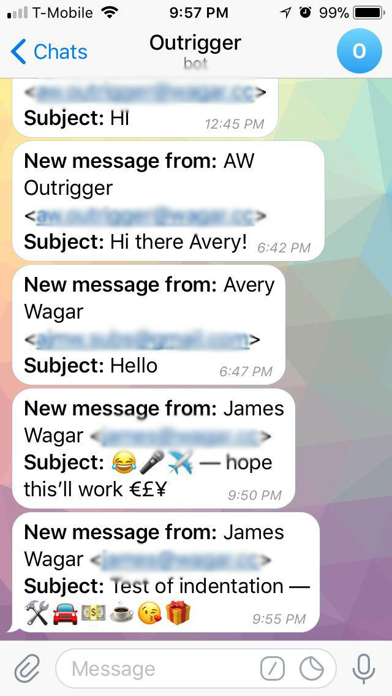

# Industrial Revolution

## Industrial Revolution

**Industrial Revolution**: The Industrial Revolution was a period of
major industrialization that took place during the late 1700s and early
1800s. This time period saw the mechanization of agriculture and textile
manufacturing and a revolution in power, including steamships and
railroads, that affected social, cultural and economic conditions. -
*Investopedia*

## Analysis

The Industrial Revolution was a period of major **industrialization**
that took place during the late 1700s and early 1800s. This time period
saw the **mechanization** of agriculture and textile manufacturing and a
revolution in power, including steamships and railroads, that affected
social, cultural and **economic conditions**.

##

-   **Industrialization**: the development of industries in a country or
    region on a wide scale.

-   **Mechanization**: Mechanization is the process of changing from
    working largely or exclusively by hand or with animals to doing that
    work with machinery.

-   **Economic conditions**: refers to the present state of the economy
    in a country or region.

## Another definition

The Industrial Revolution was the transition to new manufacturing
processes in the period from about 1760 to sometime between 1820 and
1840. - *Wikipedia*

## The Telegraph

A "telegraph" is a device for transmitting and receiving messages over
long distances, i.e., for telegraphy. ... A telegraph message sent by an
electrical telegraph operator or telegrapher using Morse code (or a
printing telegraph operator using plain text) was known as a telegram.

## Telegraph Cont'd.

-   Used to transfer messages across long distances

-   Bell's invention was used until the invention of computers

-   Morse Code is still used today

# Outrigger

## Meet Outrigger
Mechanical advantage for email
<section>
 

</section>

##

Outrigger is a better out of office responder with smarter email
notifications.

## Origin Story

The idea for Outrigger began on a family vacation and was shaped by the
observation that most email out of office (OOO) messages either create
too much friction when a message is truly urgent or rub the original
sender the wrong way. As a result, people rarely set them and when they
do, many check their email anyway.

##

This OOO message helped inspire Outrigger. It suggests five different
people that the sender could contact for assistance.

## 

By contrast, this is an Outrigger OOO message.

##
If the sender clicks the button,   the Outrigger user gets this (via
text).   In the future, the notification could go to a teammate.

Additionally, modern emails services (Google/Microsoft)   do a good job
identifying important emails but struggle to identify urgent emails.

## Why is this a problem?

There are **3.7 billion** email accounts worldwide.   Each day, a staggering
**269 billion** emails are sent.

That is **73 emails** per account per day.

___How many of these are truly urgent?___

It takes an average of **23 minutes** to regain focus after an
interruption.

There is a **growing expectation of availability** via mobile devices and it
is **exceedingly difficult to unplug**.

## 

> I built Outrigger to solve these problems and help people create some space between themselves and their email inboxes to better focus on what’s important.

## What is it?

## Features

-   **Customizable Notifications**: Get email notifications through your
    preferred channel (SMS (text), FB Messenger, Telegram, Slack,
    etc...)

-   **Auto-Replies**: When you need to focus, Outrigger responds to
    emails with a customizable message and notification link (useful for
    during school, expos, meetings, etc...).

-   **VIP Whitelist**: Immediately receive a notification when a VIP
    emails you (teachers, etc).

## Features Cont'd.

-   **Periscope Mode**: If someone replies to an email you sent within a
    set time, you get a notification. Keep important conversations
    going.

-   **Contacts Integration**: Only send auto-replies to people in your
    contacts.

-   **Customizable Filters**: limit which emails receive an auto-reply.

-   **Blacklist**: Want to ghost someone? Add them to your blacklist!

## Roadmap

-   **Calendar Integration**: Outrigger will turn itself on or off based
    on your calendar appointments or a set schedule.

-   **Machine Learning/AI**: Eventually Outrigger will determine the
    best settings for your inbox. Additionally, it will learn who is
    important in your network and prioritize urgent notifications from
    them.

## Technical

## Architecture

With a database storing user accounts, Outrigger is able to leverage
enough of Google's APIs to allow for a maximum of 6-16% CPU usage during
peak use hours (this is low).

## Infrastructure

Currently, Outrigger is running on a single free tier instance on AWS.
It will be free until the end of 2018. Afterward **Outrigger will cost
less than \$10 per month to run** (at its current scale, which supports
hundreds of users).

## Maintainability

At **11,523** Lines of JavaScript spread across **83** files, Outrigger
is reasonably maintainable. Outrigger only requires **52** dependencies
from NPM, most of which are used for logging (this is low).
