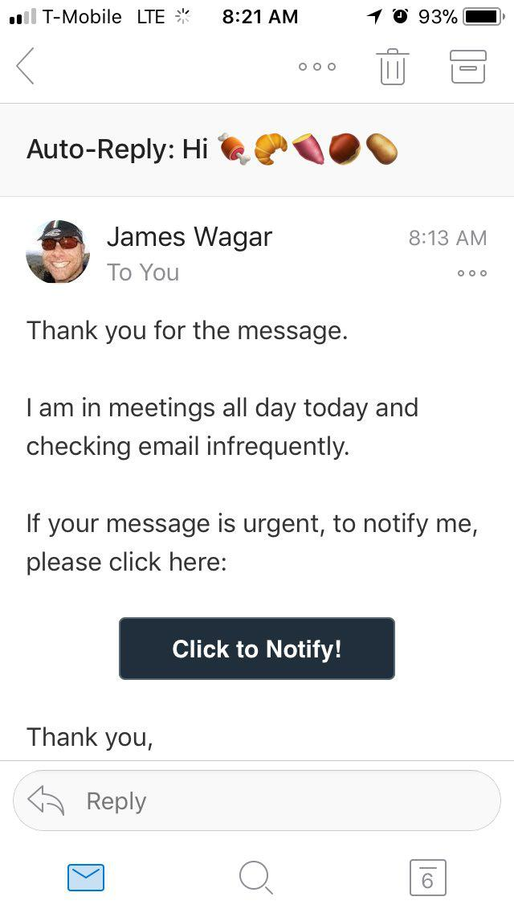

# Industrial Revolution

## Industrial Revolution
__Industrial Revolution__: The Industrial Revolution was a period of major industrialization that took place during the late 1700s and early 1800s. This time period saw the mechanization of agriculture and textile manufacturing and a revolution in power, including steam ships and railroads, that effected social, cultural and economic conditions.   - _Investopedia_

## Analysis
The Industrial Revolution was a period of major __industrialization__ that took place during the late 1700s and early 1800s. This time period saw the __mechanization__ of agriculture and textile manufacturing and a revolution in power, including steam ships and railroads, that effected social, cultural and __economic conditions__.

## 
- __industrialization__: the development of industries in a country or region on a wide scale.
- __mechanization__: Mechanization is the process of changing from working largely or exclusively by hand or with animals to doing that work with machinery.
- __economic conditions__: refers to the present state of the economy in a country or region.

## Another definition
The Industrial Revolution was the transition to new manufacturing processes in the period from about 1760 to sometime between 1820 and 1840.   - _Wikipedia_

## The Telegraph
A "telegraph" is a device for transmitting and receiving messages over long distances, i.e., for telegraphy. ... A telegraph message sent by an electrical telegraph operator or telegrapher using Morse code (or a printing telegraph operator using plain text) was known as a telegram.

## Telegraph Cont.
- Used to transfer messages across long distances
- Bells invention was used until the invention of computers
- Morse code is still used today

# Outrigger

## Meet Outrigger
<section>
 
  
  
  
</section>

## 
Outrigger is a better out of office responder. With smarter email notifications for Gmail and G-Suite users.

## Origin Story 
The idea for Outrigger began on a family vacation and was shaped by the observation that most email out of office (OOO) messages either create too much friction when a message is truly urgent or rub the original sender the wrong way. As a result, people rarely set them and when they do, many check their email anyway.

## Why?

##
There are 3.7 billion email accounts world wide. Each day, humans sent a staggering __269 billion__ emails.

##
Every day, the average office worker receives 121 emails and sends out 40 emails.

## 
> We designed and built Outrigger to help people, including ourselves, create some space between themselves and their email inboxes to better focus on whatever’s important.

## What is it?

## Features
- __Customizable Notifications__: Get email notifications through your preferred channel (SMS, Slack, Telegram, etc...)
- __Auto-Replies__: Respond to new messages with a customizable message and notification link. (Useful for expos and meetings, etc...)
- __VIP Whitelist__: Immediately receive a notification when a VIP emails you.
- __Periscope__: If someone replies to an email you sent before a user-defined interval, you get a notification.

## Features Cont.
- __Contact Integration__: Only send auto-replies to people in your contacts.
- __Customizable filters__: Setup filters limit auto-replies being sent.
- __Blacklist__: Hate your snobby neighbor? Want to stop sending them Auto-Replies? Then, add them to your blacklist!

## Roadmap
- __Calendar integration__: Outrigger will turn itself on or off based on your calendar appointments.
- __Machine Learning/AI__: Eventually Outrigger will determine the best settings for your inbox. Additionally, it will learn who is important in your network and prioritize notifications from them.

## Technical

## Architecture

With a database storing user accounts, Outrigger is able to leverage enough of Google's APIs to allow for a maximum of 6-16% CPU usage during peak use hours.

## Infrastructure
Currently, Outrigger is running on a single free tier instance on AWS. Which will be free until the end of 2019, afterwards __Outrigger will cost 24 dollars a month to run__.

## Maintainability
At __11,523__ Lines of JavaScript spread across __83__ files, Outrigger is reasonably maintainable.  
Outrigger only requires __52__ dependencies from NPM, most of which are used for logging.
